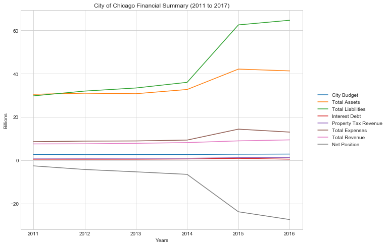
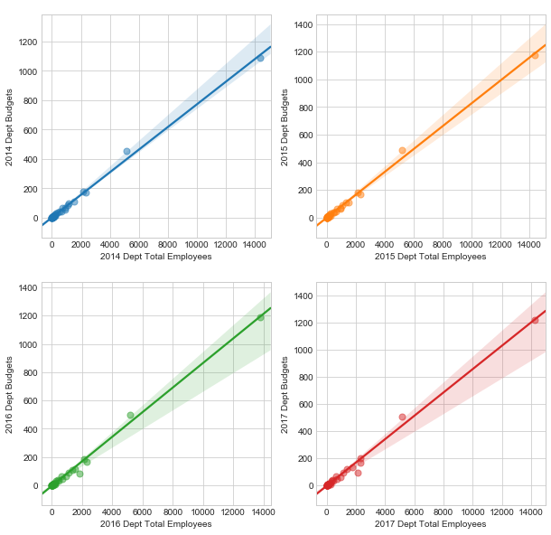
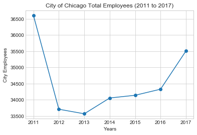
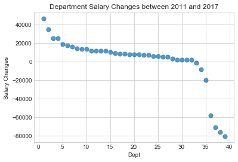

# Chicago's Finances Over Time

## Synopsis
+ Tell a visual story of Chicago's deepening debt burden and how it might be impacting city employment
## Sample Visuals

## Built With
+ Jupyter Notebook
+ Python
+ APIs
+ Pandas
+ matplotlib/seaborn plotting libraries
## Resources
+ City of Chicago Data Portal: https://data.cityofchicago.org/
+ CAFR - Comprehensive Annual Financial Reports for the City of Chicago: https://www.cityofchicago.org/city/en/depts/fin/supp_info/comprehensive_annualfinancialstatements.html
## API Reference
+ 2011 through 2017 "Budget Ordinance - Positions and Salaries" APIs found in the Administration & Finance category of the Chicago Data Portal
## Contributors
+ [Bryan Schwierzke](https://www.linkedin.com/in/bryan-schwierzke/)
+ [Motolani Alimi](https://github.com/motolanialimi)
+ [Joe Morici](https://github.com/jmorici)
## License
+ None
## Acknowledgments
+ Northwestern Data Science Boot Camp
+ [Markdown-Cheatsheet](https://github.com/adam-p/markdown-here/wiki/Markdown-Cheatsheet)
